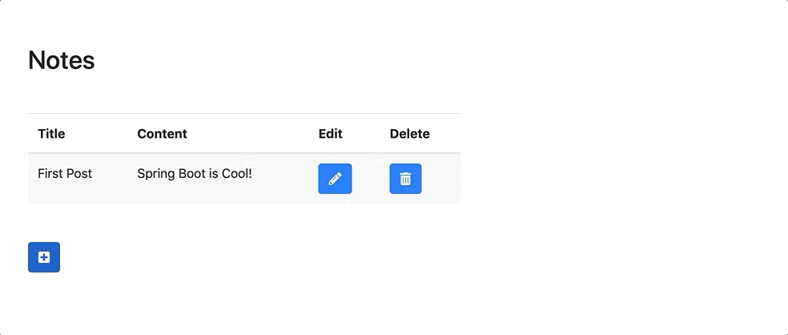
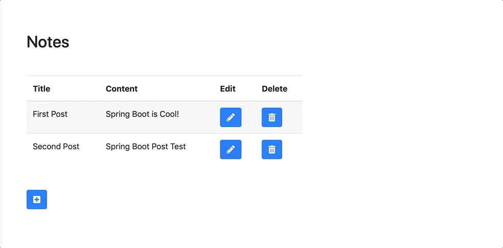
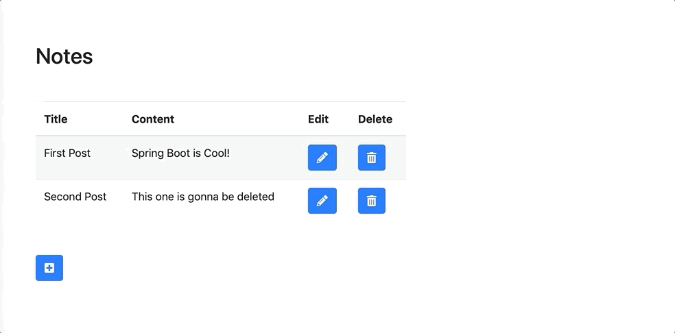

# Spring-Boot-Learning
Some Spring Boot examples used for learning purpose

## Introduction 

This is an implementation of a simple Note-Taking application using Spring Boot, Mysql, JPA and Hibernate. It has three main functions: create a new note, update an existing note and delete a note. These functions are shown in the following demo. 

## Demo

#### Create a note

#### Update a note

#### Delete a note

